<div align="center">

<!-- Hero Section avec gradient moderne -->


<br/>

<!-- Badges de contact stylisés -->
<p>
  <a href="https://www.linkedin.com/in/anass-ait-lasri/">
    
  </a>
  <a href="mailto:anass.aitlasri@gmail.com">
    
  </a>
  
</p>

</div>

<br/>

<!-- Section About avec icônes modernes -->
<div align="center">

### 👨‍💻 About Me

```typescript
const anass = {
    role: "AI Engineer",
    focus: ["LLM Agents", "RAG Systems", "Production MLOps"],
    tech_stack: {
        backend: ["Python", "FastAPI"],
        frontend: ["Next.js", "React"],
        cloud: ["AWS (EC2, S3)", "Docker", "Airflow"],
        llm: ["LangChain", "LangGraph", "LangSmith"]
    },
    mindset: "Simple, Production-Ready, Benchmark-Driven"
};
```

</div>

<br/>

<!-- Tech Stack avec design cards -->
## 🛠️ Tech Arsenal

<table align="center">
<tr>
<td align="center" width="50%">

**🤖 AI & LLM Stack**


</td>
<td align="center" width="50%">

**☁️ Cloud & DevOps**


</td>
</tr>
<tr>
<td align="center">

**🚀 Backend & APIs**


</td>
<td align="center">

**💻 Frontend & Viz**


</td>
</tr>
</table>

<br/>

<!-- Section Interests avec des cards visuelles -->
## 💡 What Drives Me

<div align="center">

<table>
<tr>
<td align="center" width="25%">


**LLM Applications**

RAG • Agents • Evals

</td>
<td align="center" width="25%">


**Architecture**

Design Patterns • Trade-offs

</td>
<td align="center" width="25%">


**Cloud & MLOps**

AWS • Docker • Airflow

</td>
<td align="center" width="25%">


**Rapid Prototyping**

FastAPI • Next.js

</td>
</tr>
</table>

</div>

<br/>

<!-- Section Philosophy avec design moderne -->
## 🎯 My Engineering Philosophy

```mermaid
graph LR
    A[📋 Organize] --> B[🧪 PoC First]
    B --> C[🔍 Benchmark]
    C --> D[🚢 Production Ready]
    D --> E[✨ Keep It Simple]
    style A fill:#0b3b5a
    style B fill:#1f6feb
    style C fill:#6f42c1
    style D fill:#2d7d46
    style E fill:#ff6b6b
```

<div align="center">



</div>

| Principle | Description |
|-----------|-------------|
| 🗂️ **Organize** | Clean structure, clear naming, comprehensive docs |
| 🧪 **PoC First** | Validate concepts quickly before scaling |
| 🔎 **Benchmark** | Choose the simplest solution that works |
| 🚢 **Production-Minded** | Environment variables, tests, CI/CD (GitHub Actions) |
| 🧭 **Keep It Simple** | Prioritize readability over complexity |

<br/>

<!-- Featured Projects avec cards visuelles -->
## 🚀 Featured Projects

<div align="center">

<table>
<tr>
<td width="50%" valign="top">

### 🤖 LLM Agents & RAG Systems

**Production-ready agentic systems**

- LangGraph multi-agent workflows
- RAG with FAISS/Chroma + citations
- LangSmith evaluation & tracing
- FastAPI backends + Next.js demos

**Tech**: LangChain • LangGraph • FastAPI • Next.js

</td>
<td width="50%" valign="top">

### ☁️ Cloud ETL Pipeline

**Automated data pipeline on AWS**

- Dockerized Airflow orchestration
- S3 data lake integration (boto3)
- Automated ETL with logging
- PostgreSQL data warehouse

**Tech**: Airflow • AWS S3 • Docker • PostgreSQL

</td>
</tr>
<tr>
<td width="50%" valign="top">

### 🔬 ML Explainability Platform

**Trust & transparency in NLP**

- CamemBERT toxicity detection
- SHAP, LIME, Integrated Gradients
- Streamlit dashboard on AWS EC2
- Real-time model interpretation

**Tech**: Transformers • SHAP • Streamlit • AWS

</td>
<td width="50%" valign="top">

### 📊 OCR → Search Pipeline

**Document intelligence system**

- Multi-format OCR extraction
- Semantic chunking & indexing
- Vector search with metadata
- Source attribution & citations

**Tech**: Tesseract • LangChain • FAISS • FastAPI

</td>
</tr>
</table>

</div>

<br/>

<!-- GitHub Stats avec design moderne -->
## 📊 GitHub Analytics

<div align="center">


</div>

<br/>

<!-- Section finale avec wave -->
<div align="center">

## 📬 Let's Connect!

**Open to opportunities in AI Engineering, LLM Applications, and RAG Systems**

<p>
  <a href="https://www.linkedin.com/in/anass-ait-lasri/">
    
  </a>
  <a href="mailto:anass.aitlasri@gmail.com">
    
  </a>
</p>

**⭐ If you find my work interesting, consider giving a star to my repositories!**


</div>
